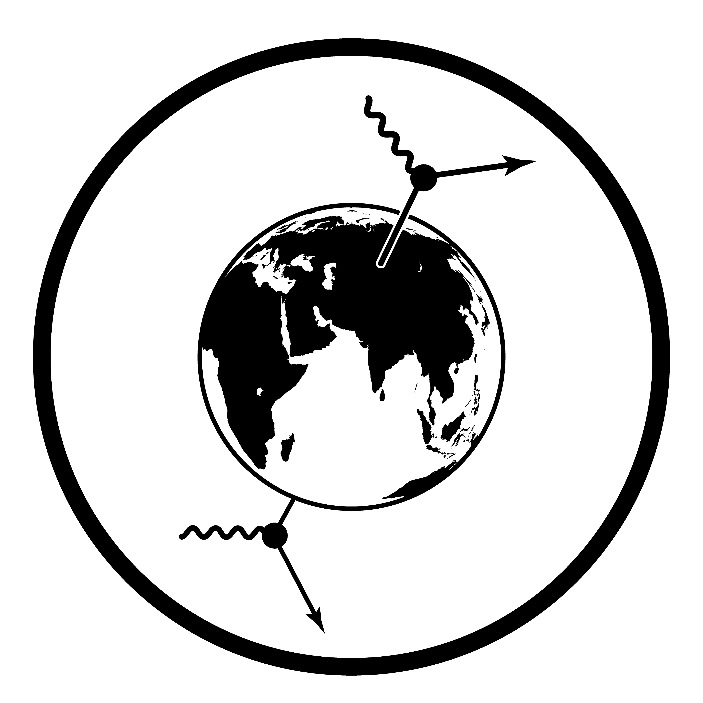

```{=html}
<style>
  .quarto-title-block {
    display: none;
  }

  .course-animation-video {
    display: block;
    width: 100%;
    aspect-ratio: 16 / 9;
    margin: 0.7rem 0 0.8rem;
    border: 1px solid rgba(255, 255, 255, 0.12);
    border-radius: 8px;
    background: #000;
    object-fit: cover;
  }

  .course-card-status + h3 {
    margin-top: 0.35rem;
  }
</style>

<div class="course-index course-subpage">
  <nav class="course-profile-links" aria-label="Навигация мини-курса">
    <a href="../index.html">Раздел физики частиц</a>
    <a href="https://neutrinohit.github.io/">NeutrinoHit</a>
    <a href="https://neutrinohit.github.io/ru/education.html#particle-physics-mini-course">Карта мини-курса</a>
  </nav>

  <section class="course-intro">
    
    <p class="course-kicker">Мини-курс</p>
    <h1>Введение в физику элементарных частиц</h1>
    <p>
      Мини-курс вводит язык физики элементарных частиц, который нужен для
      нейтринных и астрофизических экспериментов. Цель — понять, что такое
      частицы, как описываются взаимодействия, что измеряют эксперименты и
      почему Стандартная модель является не списком частиц, а связной
      квантово-полевой конструкцией.
    </p>
    <p class="course-author-note">
      Автор: Дмитрий Наумов. Основной профиль и другие курсы находятся на
      <a href="https://neutrinohit.github.io/ru/">NeutrinoHit</a>.
    </p>
  </section>

  <section aria-label="Лекции мини-курса">
    <h2 class="course-section-title">Лекции</h2>
    <div class="course-card-grid">
      <article class="course-card">
        <span class="course-card-status">лекция 1</span>
        <h3>Particles, Fields, and Interactions</h3>
        <p>Частицы, квантовые числа, поля, взаимодействия, вершины, амплитуды и сечения.</p>
        <div class="course-links"><a href="slides/01_particles_fields_interactions.html">Открыть слайды</a></div>
      </article>
      <article class="course-card">
        <span class="course-card-status">лекция 2</span>
        <h3>The Standard Model</h3>
        <p>Калибровочная инвариантность, электрослабое объединение, происхождение масс и слабый распад.</p>
        <div class="course-links"><a href="slides/02_standard_model.html">Открыть слайды</a></div>
      </article>
      <article class="course-card">
        <span class="course-card-status">приложение</span>
        <h3>Does a Massive Photon Make a Superconductor Heavier?</h3>
        <p>Разбор парадокса про эффективную массу фотона в сверхпроводнике и показания весов.</p>
        <div class="course-links"><a href="appendices/massive_photon_weight.html">Открыть приложение</a></div>
      </article>
    </div>
  </section>

  <section aria-label="Видео-анимации мини-курса">
    <h2 class="course-section-title">Видео-анимации</h2>
    <div class="course-card-grid">
      <article class="course-card">
        <span class="course-card-status">лекция 1</span>
        <h3>Scale ladder</h3>
        <video class="course-animation-video" src="exports/animations/lecture-01-scale-ladder.mp4" controls muted loop playsinline preload="metadata"></video>
        <div class="course-links"><a href="exports/animations/lecture-01-scale-ladder.mp4">MP4</a></div>
      </article>
      <article class="course-card">
        <span class="course-card-status">лекция 1</span>
        <h3>Standard Model particles</h3>
        <video class="course-animation-video" src="exports/animations/lecture-01-standard-model-particles.mp4" controls muted loop playsinline preload="metadata"></video>
        <div class="course-links"><a href="exports/animations/lecture-01-standard-model-particles.mp4">MP4</a></div>
      </article>
      <article class="course-card">
        <span class="course-card-status">лекция 1</span>
        <h3>Why particle physics?</h3>
        <video class="course-animation-video" src="exports/animations/lecture-01-why-particle-physics.mp4" controls muted loop playsinline preload="metadata"></video>
        <div class="course-links"><a href="exports/animations/lecture-01-why-particle-physics.mp4">MP4</a></div>
      </article>
      <article class="course-card">
        <span class="course-card-status">лекция 1</span>
        <h3>QCD spring</h3>
        <video class="course-animation-video" src="exports/animations/lecture-01-qcd-bears-spring.mp4" controls muted loop playsinline preload="metadata"></video>
        <div class="course-links"><a href="exports/animations/lecture-01-qcd-bears-spring.mp4">MP4</a></div>
      </article>
      <article class="course-card">
        <span class="course-card-status">лекция 1</span>
        <h3>Cross-section</h3>
        <video class="course-animation-video" src="exports/animations/lecture-01-cross-section.mp4" controls muted loop playsinline preload="metadata"></video>
        <div class="course-links"><a href="exports/animations/lecture-01-cross-section.mp4">MP4</a></div>
      </article>
      <article class="course-card">
        <span class="course-card-status">лекция 2</span>
        <h3>Lagrangian scroll</h3>
        <video class="course-animation-video" src="exports/animations/lecture-02-lagrangian-scroll.mp4" controls muted loop playsinline preload="metadata"></video>
        <div class="course-links"><a href="exports/animations/lecture-02-lagrangian-scroll.mp4">MP4</a></div>
      </article>
      <article class="course-card">
        <span class="course-card-status">лекция 2</span>
        <h3>Physicist rockets</h3>
        <video class="course-animation-video" src="exports/animations/lecture-02-physicist-rockets.mp4" controls muted loop playsinline preload="metadata"></video>
        <div class="course-links"><a href="exports/animations/lecture-02-physicist-rockets.mp4">MP4</a></div>
      </article>
      <article class="course-card">
        <span class="course-card-status">лекция 2</span>
        <h3>Accelerating electron field</h3>
        <video class="course-animation-video" src="exports/animations/lecture-02-accelerating-electron-field.mp4" controls muted loop playsinline preload="metadata"></video>
        <div class="course-links"><a href="exports/animations/lecture-02-accelerating-electron-field.mp4">MP4</a></div>
      </article>
      <article class="course-card">
        <span class="course-card-status">лекция 2</span>
        <h3>Formula cat</h3>
        <video class="course-animation-video" src="exports/animations/lecture-02-formula-cat.mp4" controls muted loop playsinline preload="metadata"></video>
        <div class="course-links"><a href="exports/animations/lecture-02-formula-cat.mp4">MP4</a></div>
      </article>
      <article class="course-card">
        <span class="course-card-status">лекция 2</span>
        <h3>Meissner effect</h3>
        <video class="course-animation-video" src="exports/animations/lecture-02-meissner-effect.mp4" controls muted loop playsinline preload="metadata"></video>
        <div class="course-links"><a href="exports/animations/lecture-02-meissner-effect.mp4">MP4</a></div>
      </article>
      <article class="course-card">
        <span class="course-card-status">лекция 2</span>
        <h3>Coupled pendulums</h3>
        <video class="course-animation-video" src="exports/animations/lecture-02-coupled-pendulums.mp4" controls muted loop playsinline preload="metadata"></video>
        <div class="course-links"><a href="exports/animations/lecture-02-coupled-pendulums.mp4">MP4</a></div>
      </article>
      <article class="course-card">
        <span class="course-card-status">лекция 2</span>
        <h3>Chiral mass gap</h3>
        <video class="course-animation-video" src="exports/animations/lecture-02-chiral-waves-mass-gap.mp4" controls muted loop playsinline preload="metadata"></video>
        <div class="course-links"><a href="exports/animations/lecture-02-chiral-waves-mass-gap.mp4">MP4</a></div>
      </article>
      <article class="course-card">
        <span class="course-card-status">лекция 2</span>
        <h3>Condensate layer</h3>
        <video class="course-animation-video" src="exports/animations/lecture-02-chiral-condensate-layer.mp4" controls muted loop playsinline preload="metadata"></video>
        <div class="course-links"><a href="exports/animations/lecture-02-chiral-condensate-layer.mp4">MP4</a></div>
      </article>
      <article class="course-card">
        <span class="course-card-status">лекция 2</span>
        <h3>The Code Runs</h3>
        <video class="course-animation-video" src="exports/animations/lecture-02-standard-model-finale.mp4" controls muted loop playsinline preload="metadata"></video>
        <div class="course-links"><a href="exports/animations/lecture-02-standard-model-finale.mp4">MP4</a></div>
      </article>
    </div>
  </section>
</div>
```
