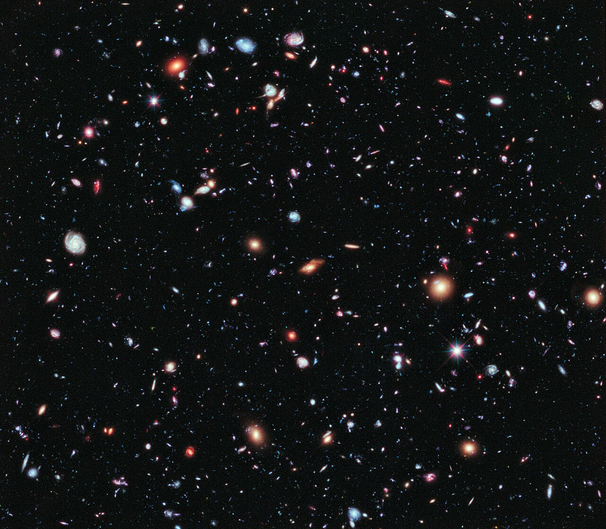
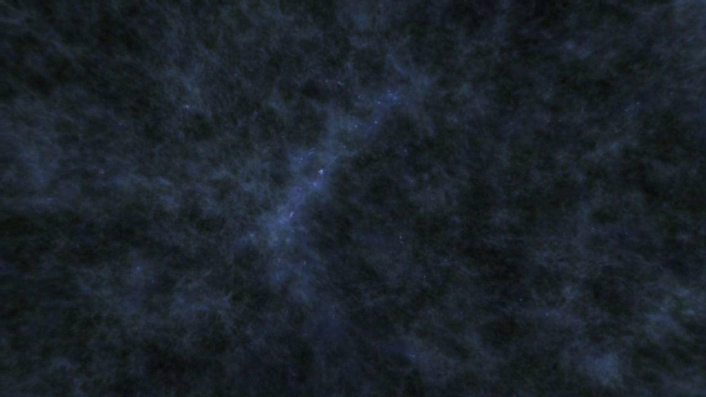
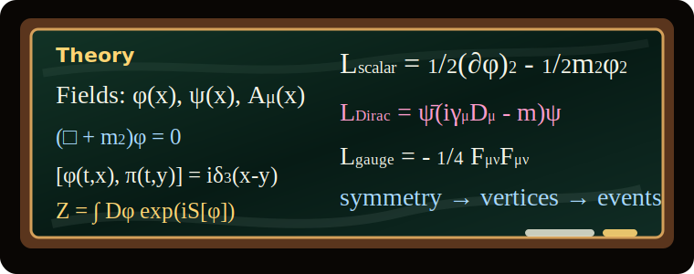
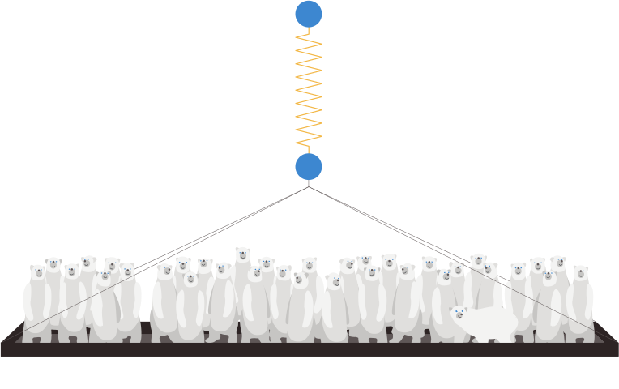

## Natural System of Units
$$
\boxed{\hbar=c=1}
$$

:::: {.columns}


::: {.column width="50%"}
- Dimensions:
$$
[\mathrm{Energy}] = [\mathrm{mass}] = [\mathrm{length}]^{-1} = [\mathrm{time}]^{-1}
$$
- Relationships:
  - Energy: $E^2 = \mathbf{p}^2 + m^2$,
  - Wavelength: $\lambda = 2\pi/p$,
  - Time: $t = 1/E$.
:::

::: {.column width="50%"}

- Conversions:
$$
\begin{aligned}
1 &= \hbar c = 197.327\ \mathrm{MeV\,fm},\\
1\mathrm{GeV}^{-1} &= 0.197\ \mathrm{fm},\\
1\mathrm{fm}&=5.067\ \mathrm{GeV}^{-1},\\
1\mathrm{s} &= 1.519\times 10^{24}\ \mathrm{GeV}^{-1},\\
\end{aligned}
$$
:::
::::

## Momentum or Coordinate?
:::: {.columns}
::: {.column width="52%"}
- The Heisenberg uncertainty:
$$
\sigma_x\sigma_p\ge \frac{\hbar}{2} \to \sigma_x\sigma_p\ge \frac{1}{2}.
$$
- Let us denote a relative momentum dispersion:
$$
\varepsilon_p\equiv \frac{\sigma_p}{p}.
$$
- Then the coordinate dispersion is:
$$
\sigma_x\ge \frac{1}{2\sigma_p} = \frac{1}{2\varepsilon_p p}=10 \, \mathrm{fm}\frac{10^{-2}}{\varepsilon_p}\frac{\mathrm{GeV}}{p}.
$$

:::

::: {.column width="48%"}

```{=html}
<div class="uncertainty-dual-panel" role="img" aria-label="A narrow momentum-space packet corresponds to a broad coordinate-space packet.">
  <svg viewBox="0 0 640 430">
    <defs>
      <linearGradient id="uncertainty-momentum-gradient" x1="0" x2="1" y1="0" y2="0">
        <stop offset="0%" stop-color="#ffd166" stop-opacity="0.1"/>
        <stop offset="50%" stop-color="#ffd166" stop-opacity="0.88"/>
        <stop offset="100%" stop-color="#ffd166" stop-opacity="0.1"/>
      </linearGradient>
      <linearGradient id="uncertainty-coordinate-gradient" x1="0" x2="1" y1="0" y2="0">
        <stop offset="0%" stop-color="#8ec5ff" stop-opacity="0.1"/>
        <stop offset="50%" stop-color="#8ec5ff" stop-opacity="0.9"/>
        <stop offset="100%" stop-color="#8ec5ff" stop-opacity="0.1"/>
      </linearGradient>
    </defs>

    <rect class="uncertainty-frame" x="20" y="24" width="600" height="382" rx="16"/>
    <text class="uncertainty-heading" x="320" y="56" text-anchor="middle">same state, two views</text>

    <g class="uncertainty-panel-top">
      <text class="uncertainty-axis-label momentum" x="58" y="96">momentum space</text>
      <line class="uncertainty-axis" x1="70" y1="160" x2="570" y2="160"/>
      <line class="uncertainty-center-line" x1="320" y1="86" x2="320" y2="160"/>
      <text class="uncertainty-axis-symbol" x="572" y="184">p</text>
      <path class="uncertainty-curve uncertainty-momentum-curve"
            d="M 190 160 C 232 160 244 86 320 86 C 396 86 408 160 450 160"
            fill="none"/>
      <line class="uncertainty-width-line uncertainty-momentum-width" x1="268" y1="177" x2="372" y2="177"/>
      <text class="uncertainty-note" x="320" y="208" text-anchor="middle">small <tspan class="uncertainty-math-label">σ</tspan><tspan class="uncertainty-subscript" baseline-shift="sub">p</tspan></text>
    </g>

    <g class="uncertainty-panel-bottom">
      <text class="uncertainty-axis-label coordinate" x="58" y="260">coordinate space</text>
      <line class="uncertainty-axis" x1="70" y1="326" x2="570" y2="326"/>
      <line class="uncertainty-center-line" x1="320" y1="252" x2="320" y2="326"/>
      <text class="uncertainty-axis-symbol" x="572" y="350">x</text>
      <path class="uncertainty-curve uncertainty-coordinate-curve"
            d="M 210 326 C 248 326 260 252 320 252 C 380 252 392 326 430 326"
            fill="none"/>
      <line class="uncertainty-width-line uncertainty-coordinate-width" x1="250" y1="344" x2="390" y2="344"/>
      <text class="uncertainty-note" x="320" y="374" text-anchor="middle">large <tspan class="uncertainty-math-label">σ</tspan><tspan class="uncertainty-subscript" baseline-shift="sub">x</tspan></text>
    </g>
  </svg>
</div>
```

:::
::::

## Momentum or Coordinate?
:::: {.columns}
::: {.column width="50%"}

- Then the coordinate dispersion is:
$$
\sigma_x\ge \frac{1}{2\sigma_p} = \frac{1}{2\varepsilon_p p}=10 \, \mathrm{fm}\frac{10^{-2}}{\varepsilon_p}\frac{\mathrm{GeV}}{p}.
$$

- Best experimental resolution 
$$
\delta_x\simeq 1\mu \mathrm{m}\gg \sigma_x.
$$ 
- Thus, experimentalists can measure the momentum of a particle with a relative precision $\varepsilon_p\sim 10^{-2}$, but cannot measure its position with a comparable precision.

:::

::: {.column width="50%"}

```{=html}
<div class="uncertainty-scale-panel" role="img" aria-label="A logarithmic scale places 10 femtometers and atomic scales inside one detector division of width 1 micrometer.">
  <svg viewBox="0 0 640 430">
    <rect class="uncertainty-frame" x="20" y="24" width="600" height="382" rx="16"/>
    <text class="uncertainty-heading" x="320" y="58" text-anchor="middle">position scale</text>
    <text class="uncertainty-scale-subtitle" x="320" y="88" text-anchor="middle">log scale in femtometers</text>

    <g class="uncertainty-caliper" transform="translate(46 112)">
      <rect class="uncertainty-caliper-bin" x="0" y="-1" width="532" height="22" rx="4"/>
      <line class="uncertainty-caliper-body" x1="0" y1="0" x2="532" y2="0"/>
      <line class="uncertainty-caliper-body" x1="0" y1="20" x2="532" y2="20"/>
      <line class="uncertainty-caliper-jaw" x1="0" y1="-18" x2="0" y2="58"/>
      <line class="uncertainty-caliper-jaw" x1="532" y1="-18" x2="532" y2="58"/>
      <text class="uncertainty-caliper-label" x="266" y="50" text-anchor="middle">one detector division: 1 μm</text>
    </g>

    <rect class="uncertainty-scale-resolution-bin" x="46" y="220" width="532" height="24" rx="12"/>
    <line class="uncertainty-scale-axis" x1="46" y1="232" x2="578" y2="232"/>

    <path class="uncertainty-scale-gaussian-fill"
          d="M 46 232 C 57 232 60 182 82 182 C 104 182 107 232 118 232 L 46 232 Z"/>
    <path class="uncertainty-scale-gaussian"
          d="M 46 232 C 57 232 60 182 82 182 C 104 182 107 232 118 232"/>
    <text class="uncertainty-gaussian-label" x="82" y="170" text-anchor="middle">wave packet</text>

    <g class="uncertainty-scale-tick uncertainty-scale-tick-quantum">
      <line x1="82" y1="204" x2="82" y2="260"/>
      <circle cx="82" cy="232" r="7"/>
      <text x="82" y="288" text-anchor="middle">10 fm</text>
      <text x="82" y="314" text-anchor="middle"><tspan class="uncertainty-math-label">σ</tspan><tspan class="uncertainty-subscript" baseline-shift="sub">x</tspan></text>
    </g>

    <g class="uncertainty-scale-tick">
      <line x1="330" y1="208" x2="330" y2="256"/>
      <circle cx="330" cy="232" r="5"/>
      <text x="330" y="288" text-anchor="middle">10<tspan class="uncertainty-superscript" baseline-shift="super">5</tspan><tspan dx="2"> fm</tspan></text>
      <text x="330" y="314" text-anchor="middle">atom</text>
    </g>

    <g class="uncertainty-scale-tick uncertainty-scale-tick-detector">
      <line x1="578" y1="190" x2="578" y2="274"/>
      <circle cx="578" cy="232" r="9"/>
      <text x="578" y="288" text-anchor="middle">10<tspan class="uncertainty-superscript" baseline-shift="super">9</tspan><tspan dx="2"> fm</tspan></text>
      <text x="578" y="314" text-anchor="middle">1 micrometer</text>
    </g>

    <text class="uncertainty-scale-emphasis" x="320" y="372" text-anchor="middle">1 micrometer is 10<tspan class="uncertainty-superscript" baseline-shift="super">8</tspan><tspan dx="2"> times larger than 10 fm</tspan></text>
  </svg>
</div>
```

:::
::::

# Matter

##


## Zoo of particles
- 118 chemical elements in the periodic table.
- More than 3000 different atomic nuclei including isotopes.
- Isotopes can be stable or unstable.
- Unstable nuclei decay via:
  - alpha (${}^4\text{He}$),
  - beta (${e^\pm + \nu}$),
  - gamma ($\gamma$) decays,
  - spontaneous fission,
  - and other processes such as neutron capture.


## Fundamental Particles
- All known matter is made of a small number of fundamental particles.
- Fundamental particles are indivisible in the framework of modern theory.
- Fundamental particles are divided into two classes:
  - Fermions: half-integer spin ($\tfrac{1}{2}\hbar, \tfrac{3}{2}\hbar, \ldots$)
  - Bosons: integer spin ($0\hbar, 1\hbar, 2\hbar, \ldots$)

## Standard Model Particle Content




## Antiparticles

For a particle and its antiparticle:

- masses are equal;
- spins are equal;
- additive charges change sign;
- electric charge changes sign;
- color changes into anticolor.

Examples:

$$
e^-\leftrightarrow e^+,\qquad
p\leftrightarrow \bar p,\qquad
n\leftrightarrow \bar n.
$$


# Fermions and Bosons

## Fermions

:::: {.columns}
::: {.column width="50%"}

- Fermions have half-integer spin and obey Fermi-Dirac statistics.

- The fundamental Standard Model (next lecture) fermions are:

  - leptons: $e,\mu,\tau,\nu_e,\nu_\mu,\nu_\tau$;
  - quarks: $u,d,s,c,b,t$.

{.slide-image-center .nostretch width=96% fig-align="center"}

:::
::: {.column width="50%"}

```{=html}
<video class="slide-video media-height-lg" data-autoplay loop muted playsinline controls>
  <source src="media/simplespinwithsphere.mp4" type="video/mp4">
</video>
```

::: {.media-caption}
We are many-sheeted Möbius strips. Live with that.
:::

:::
::::

## Bosons

- Bosons have integer spin and obey Bose-Einstein statistics.

- In the Standard Model:

  - gauge bosons: $\gamma, g, W^\pm, Z$;
  - Higgs boson: $H$.

## Leptons

- Leptons do not carry color charge.

- Charged leptons:

$$
e^-,\quad \mu^-,\quad \tau^-.
$$

- Neutrinos:

$$
\nu_e,\quad \nu_\mu,\quad \nu_\tau.
$$

- Neutrinos have $Q=0$, so they do not participate in electromagnetic interactions.


## Quarks

- Quarks carry color charge and participate in the strong interaction.

- Electric charges:

$$
Q_u=Q_c=Q_t=+\frac23,\qquad
Q_d=Q_s=Q_b=-\frac13.
$$

- Because of confinement, free quarks are not observed as isolated particles.

- Observable hadrons:
  - baryons: $qqq$, for example $p,n$;
  - mesons: $q\bar q$, for example $\pi,K$.

## Gauge Bosons

Gauge bosons are associated with gauge interactions:

| Boson | Interaction | Couples to |
|---|---|---|
| $\gamma$ | electromagnetic | electric charge |
| $g$ | strong | color |
| $W^\pm$ | weak charged current | weak doublets |
| $Z$ | weak neutral current | electroweak charge |

$$
\mathrm{spin}=1.
$$

## Higgs Boson

- The Higgs boson is a scalar:

$$
\mathrm{spin}=0.
$$

- Higgs boson is not a "fifth force" in a sense of "gauge interactions"


# Particles and Fields

## Coupled Oscillators as a Field Model


```{=html}
<div class="timed-video has-overlay oscillator-field-video" data-timed-video>
  <video class="slide-video media-width-full media-height-xl oscillator-field-video-media" data-autoplay loop muted playsinline controls>
    <source src="media/coupled-oscillators-2d/CoupledOscillators2D.mp4" type="video/mp4">
  </video>
  <div class="timed-video-overlay oscillator-equations-overlay">
    <div class="timed-video-overlay-title">Normal modes: <span class="math inline">\(w=\omega_{mn}\)</span></div>
    <span class="math display">\[
    M\ddot q_{ij}=-k_0 q_{ij}-k_c(4q_{ij}-q_{i+1,j}-q_{i-1,j}-q_{i,j+1}-q_{i,j-1})
    \]</span>
    <span class="math display">\[
    q_{ij}^{(m,n)}(t)=A_{mn}\sin\!\frac{m\pi i}{N_x+1}\sin\!\frac{n\pi j}{N_y+1}\cos(\omega_{mn}t)
    \]</span>
    <span class="math display">\[
    \omega_{mn}^2=\frac{k_0+4k_c\left[\sin^2\!\frac{m\pi}{2(N_x+1)}+\sin^2\!\frac{n\pi}{2(N_y+1)}\right]}{M}
    \]</span>
    <div class="timed-video-overlay-note">
      The pair <span class="math inline">\((m,n)\)</span> labels standing-wave harmonics in <span class="math inline">\(x,y\)</span>.
    </div>
  </div>
  <div class="timed-video-caption oscillator-caption" data-caption-display aria-live="polite">
    <span data-caption-text></span>
  </div>
  <ol class="timed-video-cues oscillator-cues" data-caption-cues aria-hidden="true" hidden>
    <li data-start="0.000" data-end="1.800">Coupled two-dimensional oscillator lattice.</li>
    <li data-start="1.800" data-end="7.916">Mode (1,1), w = 2.36</li>
    <li data-start="7.916" data-end="13.668">Mode (1,2), w = 2.54</li>
    <li data-start="13.668" data-end="19.420">Mode (2,1), w = 2.54</li>
    <li data-start="19.420" data-end="24.874">Mode (2,2), w = 2.70</li>
    <li data-start="24.874" data-end="25.674">Local kick at (5,5)</li>
    <li data-start="25.674" data-end="35.243">The disturbance spreads through the coupled lattice.</li>
    <li data-start="35.243" data-end="38.643">The discrete lattice becomes a continuous field.</li>
    <li data-start="38.643" data-end="43.443">Field wave evolution</li>
    <li data-start="43.443" data-end="44.700">Particles are localized excitations of fields.</li>
  </ol>
</div>
```

## Quantum Field and Particles

- A field assigns a dynamical variable to every point in space:
  $$
  q_i(t)\ \longrightarrow\ \phi(\mathbf x,t).
  $$
- It can be viewed as the continuum limit of many coupled oscillators:
  $$
  N\to\infty,\qquad a\to 0,\qquad Na=\mathrm{fixed}.
  $$
- Quantization turns each normal mode into a quantum oscillator.
- A particle with definite momentum is one quantum of such a normal mode:
  $$
  \sqrt{2E_{\mathbf p}}a^\dagger_{\mathbf p}|0\rangle = |\mathbf p\rangle .
  $$
- The vacuum is the zero-particles state of the fields, not empty space.
- Interactions create, destroy, and transform field excitations.


## Free Equations of Motion and Solutions

- Scalar Field:

$$
(\partial^2+m^2)\phi=0 \rightarrow \phi(x)=\int\!\frac{d^3p}{(2\pi)^3}\frac{1}{\sqrt{2E_{\mathbf p}}}\left[a_{\mathbf p}e^{-ip\cdot x}+a^\dagger_{\mathbf p}e^{ip\cdot x}\right].
$$

- Spinor Field

$$
(i\gamma^\mu\partial_\mu-m)\psi=0 \rightarrow \psi(x)=\sum_s\int\!\frac{d^3p}{(2\pi)^3}\frac{1}{\sqrt{2E_{\mathbf p}}}\left[a_s(\mathbf p)u_s(\mathbf p)e^{-ip\cdot x}+b_s^\dagger(\mathbf p)v_s(\mathbf p)e^{ip\cdot x}\right].
$$

$$
(\not p-m)u_s=0,\qquad
(\not p+m)v_s=0.
$$

## Free Equations of Motion and Solutions

- Vector Field

$$
\partial_\mu F^{\mu\nu}=0 \leftrightarrow \partial_\mu A^\mu=0 \rightarrow
A_\mu(x)=
\sum_\lambda\int\!\frac{d^3p}{(2\pi)^3}
\frac{1}{\sqrt{2E_{\mathbf p}}}
\left[
\epsilon_\mu^{(\lambda)}a_{\lambda,\mathbf p}e^{-ip\cdot x}
+\epsilon_\mu^{(\lambda)\ast}a^\dagger_{\lambda,\mathbf p}e^{ip\cdot x}
\right],
$$


## The Standard Model as Quantum Fields

```{=html}
<div class="sm-fields-object-overlay">
  <video class="slide-video media-width-full media-height-xl" data-autoplay muted playsinline controls>
    <source src="media/sm-field-mattress/StandardModelFieldMattress.mp4" type="video/mp4">
  </video>

  <div class="sm-field-content-box" aria-label="Standard Model field content">
    <div class="sm-field-content-title">SM field content</div>
    <div class="sm-field-content-row sm-field-content-quarks">quarks: <span class="math inline">\(u,d,c,s,t,b\quad(\times 3)\)</span></div>
    <div class="sm-field-content-row sm-field-content-leptons">charged leptons: <span class="math inline">\(e,\mu,\tau\)</span></div>
    <div class="sm-field-content-row sm-field-content-neutrinos">neutrinos: <span class="math inline">\(\nu_e,\nu_\mu,\nu_\tau\)</span></div>
    <div class="sm-field-content-row sm-field-content-gauge">gauge: <span class="math inline">\(\gamma,\ g,\ W^\pm,\ Z\)</span></div>
    <div class="sm-field-content-row sm-field-content-scalar">scalar: <span class="math inline">\(H\)</span></div>
  </div>

  <figure class="sm-field-object sm-field-object-universe">
    
    <figcaption>Universe</figcaption>
  </figure>

  <figure class="sm-field-object sm-field-object-star">
    
    <figcaption>Star</figcaption>
  </figure>

  <figure class="sm-field-object sm-field-object-planet">
    
    <figcaption>Planet</figcaption>
  </figure>

  <figure class="sm-field-object sm-field-object-phone">
    
    <figcaption>Phone</figcaption>
  </figure>

  <figure class="sm-field-object sm-field-object-cat">
    
    <figcaption>Cat</figcaption>
  </figure>
</div>
```

## Why Particle Physics?
:::: {.columns}
::: {.column width="50%"}
- Fundamental questions:
  - Which fields fill the Universe?
  - What are their quanta?
  - How do they interact?
- Methods:
    - Theoretical: quantum field theory, symmetries, and conservation laws.
    - Experimental: particle accelerators, detectors, and data analysis. 
:::

::: {.column width="50%"}
```{=html}
<div class="why-particle-visuals">
  
  
</div>
```
:::
::::

# Experimental Pillars of the Standard Model

## Experiments did not just discover particles. They uncovered the underlying structure of the theory.



# Interactions

## Interactions as Lagrangian Terms



## Electromagnetic Interaction

:::: {.columns}
::: {.column width="42%"}

Electron-electron scattering:

$$
e^- e^- \to e^- e^-.
$$

The electrons exchange a virtual photon. The diagram encodes the allowed QED vertices and the momentum flow in the amplitude.

:::
::: {.column width="58%"}

```{=html}
<video class="slide-video media-width-sm media-height-sm" data-autoplay loop muted playsinline controls>
  <source src="media/feynman-scattering/ElectronElectronScattering.mp4" type="video/mp4">
</video>
```

:::
::::

## Weak Neutral Current

:::: {.columns}
::: {.column width="42%"}

Muon-neutrino scattering through a neutral weak current:

$$
\nu_\mu \mu^- \to \nu_\mu \mu^-.
$$

The mediator is a virtual $Z$ boson. Flavor is conserved at the neutral-current vertex.

:::
::: {.column width="58%"}

```{=html}
<video class="slide-video media-width-sm media-height-sm" data-autoplay loop muted playsinline controls>
  <source src="media/feynman-scattering/NuMuMuonScatteringViaZ.mp4" type="video/mp4">
</video>
```

:::
::::

## Weak Charged Current

:::: {.columns}
::: {.column width="42%"}

A charged-current process changes lepton flavor:

$$
\nu_\mu e^- \to \nu_e \mu^-.
$$

The mediator is a virtual $W$ boson. The electric charge is conserved at each vertex.

:::
::: {.column width="58%"}

```{=html}
<video class="slide-video media-width-sm media-height-sm" data-autoplay loop muted playsinline controls>
  <source src="media/feynman-scattering/NuMuElectronToNuEMuonScattering.mp4" type="video/mp4">
</video>
```

:::
::::

## Strong Interaction

:::: {.columns}
::: {.column width="42%"}

Quark-quark scattering:

$$
q q \to q q.
$$

Quarks exchange a virtual gluon. The strong interaction couples to color charge, not to electric charge.

:::
::: {.column width="58%"}

```{=html}
<video class="slide-video media-width-sm media-height-sm" data-autoplay loop muted playsinline controls>
  <source src="media/feynman-scattering/QuarkQuarkScattering.mp4" type="video/mp4">
</video>
```

:::
::::

```{=html}

```

# Rutherford Scattering
:::: {.columns}
::: {.column width="50%"}
- Rutherford scattering is a classic experiment that revealed the structure of the atom.
- Alpha particles are scattered off a thin gold foil, and their deflection angles are measured.
- The results showed that most of the alpha particles passed through the foil with little deflection, while a small fraction were deflected at large angles.
- This led to the conclusion that atoms have a small, dense nucleus surrounded by a cloud of electrons.
:::

::: {.column width="50%"}

```{=html}
<video class="slide-video media-width-full media-height-lg" data-autoplay loop muted playsinline controls>
  <source src="media/rutherford-geiger-marsden.mp4" type="video/mp4">
</video>
```

:::

::::

## To Understand the Inside

:::: {.columns}
::: {.column width="46%"}

- Sometimes the fastest way to understand an object is to take it apart.
- Rutherford scattering did this for atoms without touching them directly.
- This experiment was pivotal in the development of the nuclear model of the atom.
- It also became a basic instrument for later discoveries in particle physics.

:::
::: {.column width="54%"}

::: {.media-figure}
{fig-alt="A curious child wearing safety goggles taking apart a toy robot to see its internal mechanism"}
:::

:::
::::

# The cross-section

:::: {.columns}
::: {.column width="43%"}

- The cross-section is a measure of the probability of a scattering event occurring.
- It is defined as the effective area that a target presents to an incoming particle:

$$
\text{interaction rate}
=
\sigma \times \text{flux}.
$$

The larger the effective area, the more particles scatter out of the beam.

:::
::: {.column width="57%"}

```{=html}
<div class="cross-section-animation" role="img" aria-label="Six regular beams of particles pass by a red target. Particles closer to the target scatter more strongly, while the two outer beams continue without changing direction.">
  <svg viewBox="0 0 720 420">
    <defs>
      <radialGradient id="cross-section-target-glow" cx="50%" cy="50%" r="50%">
        <stop offset="0%" stop-color="#ffd166" stop-opacity="0.88"/>
        <stop offset="64%" stop-color="#ffd166" stop-opacity="0.24"/>
        <stop offset="100%" stop-color="#ffd166" stop-opacity="0"/>
      </radialGradient>

      <path id="cross-path-clear-top" d="M 36 82 L 684 82"/>
      <path id="cross-path-far-top" d="M 36 132 L 356 132 C 442 132 536 124 684 110"/>
      <path id="cross-path-near-top" d="M 36 182 L 356 182 C 444 170 540 124 684 58"/>
      <path id="cross-path-near-bottom" d="M 36 232 L 356 232 C 444 244 540 292 684 356"/>
      <path id="cross-path-far-bottom" d="M 36 282 L 356 282 C 442 282 536 292 684 306"/>
      <path id="cross-path-clear-bottom" d="M 36 332 L 684 332"/>
    </defs>

    <rect class="cross-section-window" x="18" y="24" width="684" height="372" rx="18"/>

    <g class="cross-section-paths">
      <use href="#cross-path-clear-top"/>
      <use href="#cross-path-far-top"/>
      <use href="#cross-path-near-top"/>
      <use href="#cross-path-near-bottom"/>
      <use href="#cross-path-far-bottom"/>
      <use href="#cross-path-clear-bottom"/>
    </g>

    <g class="cross-section-target">
      <circle class="cross-section-effective-area" cx="360" cy="207" r="86"/>
      <circle class="cross-section-core" cx="360" cy="207" r="25"/>
      <circle class="cross-section-core-dot" cx="360" cy="207" r="7"/>
    </g>

    <g class="cross-section-particles">
      <g class="stream-particle is-unscattered"><circle r="8"/><animateMotion dur="4.8s" begin="-4.8s" repeatCount="indefinite"><mpath href="#cross-path-clear-top"/></animateMotion></g>
      <g class="stream-particle is-unscattered"><circle r="8"/><animateMotion dur="4.8s" begin="-3.6s" repeatCount="indefinite"><mpath href="#cross-path-clear-top"/></animateMotion></g>
      <g class="stream-particle is-unscattered"><circle r="8"/><animateMotion dur="4.8s" begin="-2.4s" repeatCount="indefinite"><mpath href="#cross-path-clear-top"/></animateMotion></g>
      <g class="stream-particle is-unscattered"><circle r="8"/><animateMotion dur="4.8s" begin="-1.2s" repeatCount="indefinite"><mpath href="#cross-path-clear-top"/></animateMotion></g>

      <g class="stream-particle"><circle r="8"/><animateMotion dur="4.8s" begin="-4.56s" repeatCount="indefinite"><mpath href="#cross-path-far-top"/></animateMotion></g>
      <g class="stream-particle"><circle r="8"/><animateMotion dur="4.8s" begin="-3.36s" repeatCount="indefinite"><mpath href="#cross-path-far-top"/></animateMotion></g>
      <g class="stream-particle"><circle r="8"/><animateMotion dur="4.8s" begin="-2.16s" repeatCount="indefinite"><mpath href="#cross-path-far-top"/></animateMotion></g>
      <g class="stream-particle"><circle r="8"/><animateMotion dur="4.8s" begin="-0.96s" repeatCount="indefinite"><mpath href="#cross-path-far-top"/></animateMotion></g>

      <g class="stream-particle"><circle r="8"/><animateMotion dur="4.8s" begin="-4.32s" repeatCount="indefinite"><mpath href="#cross-path-near-top"/></animateMotion></g>
      <g class="stream-particle"><circle r="8"/><animateMotion dur="4.8s" begin="-3.12s" repeatCount="indefinite"><mpath href="#cross-path-near-top"/></animateMotion></g>
      <g class="stream-particle"><circle r="8"/><animateMotion dur="4.8s" begin="-1.92s" repeatCount="indefinite"><mpath href="#cross-path-near-top"/></animateMotion></g>
      <g class="stream-particle"><circle r="8"/><animateMotion dur="4.8s" begin="-0.72s" repeatCount="indefinite"><mpath href="#cross-path-near-top"/></animateMotion></g>

      <g class="stream-particle"><circle r="8"/><animateMotion dur="4.8s" begin="-4.08s" repeatCount="indefinite"><mpath href="#cross-path-near-bottom"/></animateMotion></g>
      <g class="stream-particle"><circle r="8"/><animateMotion dur="4.8s" begin="-2.88s" repeatCount="indefinite"><mpath href="#cross-path-near-bottom"/></animateMotion></g>
      <g class="stream-particle"><circle r="8"/><animateMotion dur="4.8s" begin="-1.68s" repeatCount="indefinite"><mpath href="#cross-path-near-bottom"/></animateMotion></g>
      <g class="stream-particle"><circle r="8"/><animateMotion dur="4.8s" begin="-0.48s" repeatCount="indefinite"><mpath href="#cross-path-near-bottom"/></animateMotion></g>

      <g class="stream-particle"><circle r="8"/><animateMotion dur="4.8s" begin="-3.84s" repeatCount="indefinite"><mpath href="#cross-path-far-bottom"/></animateMotion></g>
      <g class="stream-particle"><circle r="8"/><animateMotion dur="4.8s" begin="-2.64s" repeatCount="indefinite"><mpath href="#cross-path-far-bottom"/></animateMotion></g>
      <g class="stream-particle"><circle r="8"/><animateMotion dur="4.8s" begin="-1.44s" repeatCount="indefinite"><mpath href="#cross-path-far-bottom"/></animateMotion></g>
      <g class="stream-particle"><circle r="8"/><animateMotion dur="4.8s" begin="-0.24s" repeatCount="indefinite"><mpath href="#cross-path-far-bottom"/></animateMotion></g>

      <g class="stream-particle is-unscattered"><circle r="8"/><animateMotion dur="4.8s" begin="-3.6s" repeatCount="indefinite"><mpath href="#cross-path-clear-bottom"/></animateMotion></g>
      <g class="stream-particle is-unscattered"><circle r="8"/><animateMotion dur="4.8s" begin="-2.4s" repeatCount="indefinite"><mpath href="#cross-path-clear-bottom"/></animateMotion></g>
      <g class="stream-particle is-unscattered"><circle r="8"/><animateMotion dur="4.8s" begin="-1.2s" repeatCount="indefinite"><mpath href="#cross-path-clear-bottom"/></animateMotion></g>
      <g class="stream-particle is-unscattered"><circle r="8"/><animateMotion dur="4.8s" begin="0s" repeatCount="indefinite"><mpath href="#cross-path-clear-bottom"/></animateMotion></g>
    </g>

    <text class="cross-section-note" x="46" y="378">regular flux</text>
    <text class="cross-section-note" x="672" y="378" text-anchor="end">closer encounter = larger angle</text>
  </svg>
</div>
```

:::
::::

## The cross-section 
::: incremental
- For a process:
$$
p+\mathrm{nucleus}\to p+\mathrm{nucleus}
$$
classical theory and **QED** 
predict the same dependence of the differential cross-section 
$$
\frac{d\sigma}{d\Omega} \propto \frac{1}{\sin^4(\theta/2)}.
$$
 
- The total cross-section is divering:
$$
\sigma \propto \int d\Omega \frac{1}{\sin^4(\theta/2)} = \infty.
$$
- Experimentally, the total cross-section is finite.
- What is the reason for this discrepancy?!
:::

## The plane wave assumption
::: incremental
- If the plane wave of the incoming particle is replaced by a **wave packet**:
  - the zero-angle amplitude is finite with its phase logarithmically diverging.
  - the non-zero angle aplitude is logarithmically diverging.
- The discrepancy is softened but not removed.  

:::

## Zero photons assumtion

:::: {.columns}
::: {.column width="50%"}

- We silently assumed that the incoming and outgoing states contain **zero photons**:
$$
p+\mathrm{nucleus}\to p+\mathrm{nucleus}
$$
- But the charged particle is accelerated in the Coulomb field of the nucleus and emits photons. Thus the assumptiion is not valid. The correct process is:
$$
p+\mathrm{nucleus}\to p+\mathrm{nucleus}+n\gamma.
$$

:::

::: {.column width="50%"}

```{=html}
<video class="slide-video media-width-full media-height-lg" data-autoplay loop muted playsinline controls>
  <source src="media/radiating_charge_pyqtgraph_3d.mp4" type="video/mp4">
</video>
```

:::
::::

## The solution

:::: {.columns}
::: {.column width="45%"}

- The question “exactly zero photons” is not physical for charged particles.
- A detector has a finite photon-energy resolution $\Delta E$.
- Therefore the observable quantity is an **inclusive** cross-section:

$$
d\sigma_{\mathrm{obs}}
=
d\sigma(p\to p')
+
\sum_{E_\gamma<\Delta E}
d\sigma(p\to p'+n\gamma).
$$

Soft photons that cannot be resolved must be summed over.

:::
::: {.column width="55%"}

Let
$$
L=\ln\frac{Q^2}{m^2},
\qquad
\ell_\mu=\ln\frac{Q^2}{\mu^2},
\qquad
Q^2=-q^2 .
$$

Real soft photons:
$$
\frac{d\sigma_{\mathrm{real}}}{d\Omega}
=
\left(\frac{d\sigma}{d\Omega}\right)_0
\left[
1+\frac{\alpha}{\pi}L\ell_\mu+O(\alpha^2)
\right].
$$

Virtual photons:
$$
\frac{d\sigma_{\mathrm{virt}}}{d\Omega}
=
\left(\frac{d\sigma}{d\Omega}\right)_0
\left[
1-\frac{\alpha}{\pi}L\ell_\mu+O(\alpha^2)
\right].
$$

$$
\boxed{
d\sigma_{\mathrm{obs}}
=d\sigma_{\mathrm{real}}+d\sigma_{\mathrm{virt}}
\quad \text{is finite.}
}
$$

:::
::::

# Summary

- Matter is described by quantum fields, basic objects filling the Universe.
- Particles are quanta of these fields.
- Interactions are constrained by symmetries and charges.
- Experiments revealed the Standard Model structure.
- What is the Standard Model?
