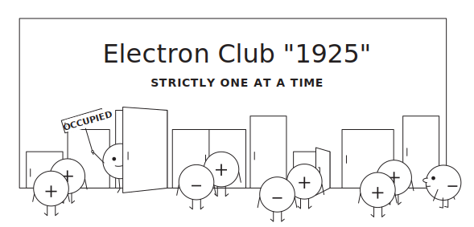

## Natural System of Units
$$
\boxed{\hbar=c=1}
$$

:::: {.columns}

::: {.column width="50%"}
- Dimensions:
$$
[\mathrm{Energy}] = [\mathrm{mass}] = [\mathrm{length}]^{-1} = [\mathrm{time}]^{-1}
$$
- Relationships:
  - Energy: $E^2 = \mathbf{p}^2 + m^2$,
  - Wavelength: $\lambda = 2\pi/p$,
  - Time: $t = 1/E$.
:::

::: {.column width="50%"}

- Conversions:
$$
\begin{aligned}
1 &= \hbar c = 197.327\ \mathrm{MeV\,fm},\\
1\mathrm{GeV}^{-1} &= 0.197\ \mathrm{fm},\\
1\mathrm{fm}&=5.067\ \mathrm{GeV}^{-1},\\
1\mathrm{s} &= 1.519\times 10^{24}\ \mathrm{GeV}^{-1},\\
\end{aligned}
$$
:::
::::

## Momentum or Coordinate?
:::: {.columns}
::: {.column width="52%"}
- The Heisenberg uncertainty:
$$
\sigma_x\sigma_p\ge \frac{\hbar}{2} \to \sigma_x\sigma_p\ge \frac{1}{2}.
$$
- Let us denote a relative momentum dispersion:
$$
\varepsilon_p\equiv \frac{\sigma_p}{p}.
$$
- Then the coordinate dispersion is:
$$
\sigma_x\ge \frac{1}{2\sigma_p} = \frac{1}{2\varepsilon_p p}=10 \, \mathrm{fm}\frac{10^{-2}}{\varepsilon_p}\frac{\mathrm{GeV}}{p}.
$$

:::

::: {.column width="48%"}



:::
::::

## Momentum or Coordinate?
:::: {.columns}
::: {.column width="50%"}

- Then the coordinate dispersion is:
$$
\sigma_x\ge \frac{1}{2\sigma_p} = \frac{1}{2\varepsilon_p p}=10 \, \mathrm{fm}\frac{10^{-2}}{\varepsilon_p}\frac{\mathrm{GeV}}{p}.
$$

- Best experimental resolution 
$$
\delta_x\simeq 1\mu \mathrm{m}\gg \sigma_x.
$$ 
- Thus, experimentalists can measure the momentum of a particle with a relative precision $\varepsilon_p\sim 10^{-2}$, but cannot measure its position with a comparable precision.

:::

::: {.column width="50%"}



:::
::::

# Matter

##


## Zoo of particles
- 118 chemical elements in the periodic table.
- More than 3000 different atomic nuclei including isotopes.
- Isotopes can be stable or unstable.
- Unstable nuclei decay via:
  - alpha (${}^4\text{He}$),
  - beta (${e^\pm + \nu}$),
  - gamma ($\gamma$) decays,
  - spontaneous fission,
  - and other processes such as neutron capture.

## Fundamental Particles
- All known matter is made of a small number of fundamental particles.
- Fundamental particles are indivisible in the framework of modern theory.
- Fundamental particles are divided into two classes:
  - Fermions: half-integer spin ($\tfrac{1}{2}\hbar, \tfrac{3}{2}\hbar, \ldots$)
  - Bosons: integer spin ($0\hbar, 1\hbar, 2\hbar, \ldots$)

## Standard Model Particle Content



## Antiparticles

For a particle and its antiparticle:

- masses are equal;
- spins are equal;
- additive charges change sign;
- electric charge changes sign;
- color changes into anticolor.

Examples:

$$
e^-\leftrightarrow e^+,\qquad
p\leftrightarrow \bar p,\qquad
n\leftrightarrow \bar n.
$$

# Fermions and Bosons

## Fermions

:::: {.columns}
::: {.column width="50%"}

- Fermions have half-integer spin and obey Fermi-Dirac statistics.

- The fundamental Standard Model (next lecture) fermions are:

  - leptons: $e,\mu,\tau,\nu_e,\nu_\mu,\nu_\tau$;
  - quarks: $u,d,s,c,b,t$.

{.slide-image-center .nostretch width=96% fig-align="center"}

:::
::: {.column width="50%"}



::: {.media-caption}
We are many-sheeted Möbius strips. Live with that.
:::

:::
::::

## Bosons

- Bosons have integer spin and obey Bose-Einstein statistics.

- In the Standard Model:

  - gauge bosons: $\gamma, g, W^\pm, Z$;
  - Higgs boson: $H$.

## Leptons

- Leptons do not carry color charge.

- Charged leptons:

$$
e^-,\quad \mu^-,\quad \tau^-.
$$

- Neutrinos:

$$
\nu_e,\quad \nu_\mu,\quad \nu_\tau.
$$

- Neutrinos have $Q=0$, so they do not participate in electromagnetic interactions.

## Quarks

- Quarks carry color charge and participate in the strong interaction.

- Electric charges:

$$
Q_u=Q_c=Q_t=+\frac23,\qquad
Q_d=Q_s=Q_b=-\frac13.
$$

- Because of confinement, free quarks are not observed as isolated particles.

- Observable hadrons:
  - baryons: $qqq$, for example $p,n$;
  - mesons: $q\bar q$, for example $\pi,K$.

## Gauge Bosons

Gauge bosons are associated with gauge interactions:

| Boson | Interaction | Couples to |
|---|---|---|
| $\gamma$ | electromagnetic | electric charge |
| $g$ | strong | color |
| $W^\pm$ | weak charged current | weak doublets |
| $Z$ | weak neutral current | electroweak charge |

$$
\mathrm{spin}=1.
$$

## Higgs Boson

- The Higgs boson is a scalar:

$$
\mathrm{spin}=0.
$$

- Higgs boson is not a "fifth force" in a sense of "gauge interactions"

# Particles and Fields

## Coupled Oscillators as a Field Model



## Quantum Field and Particles

- A field assigns a dynamical variable to every point in space:
  $$
  q_i(t)\ \longrightarrow\ \phi(\mathbf x,t).
  $$
- It can be viewed as the continuum limit of many coupled oscillators:
  $$
  N\to\infty,\qquad a\to 0,\qquad Na=\mathrm{fixed}.
  $$
- Quantization turns each normal mode into a quantum oscillator.
- A particle with definite momentum is one quantum of such a normal mode:
  $$
  \sqrt{2E_{\mathbf p}}a^\dagger_{\mathbf p}|0\rangle = |\mathbf p\rangle .
  $$
- The vacuum is the zero-particles state of the fields, not empty space.
- Interactions create, destroy, and transform field excitations.

## Free Equations of Motion and Solutions

- Scalar Field:

$$
(\partial^2+m^2)\phi=0 \rightarrow \phi(x)=\int\!\frac{d^3p}{(2\pi)^3}\frac{1}{\sqrt{2E_{\mathbf p}}}\left[a_{\mathbf p}e^{-ip\cdot x}+a^\dagger_{\mathbf p}e^{ip\cdot x}\right].
$$

- Spinor Field

$$
(i\gamma^\mu\partial_\mu-m)\psi=0 \rightarrow \psi(x)=\sum_s\int\!\frac{d^3p}{(2\pi)^3}\frac{1}{\sqrt{2E_{\mathbf p}}}\left[a_s(\mathbf p)u_s(\mathbf p)e^{-ip\cdot x}+b_s^\dagger(\mathbf p)v_s(\mathbf p)e^{ip\cdot x}\right].
$$

$$
(\not p-m)u_s=0,\qquad
(\not p+m)v_s=0.
$$

## Free Equations of Motion and Solutions

- Vector Field

$$
\partial_\mu F^{\mu\nu}=0 \leftrightarrow \partial_\mu A^\mu=0 \rightarrow
A_\mu(x)=
\sum_\lambda\int\!\frac{d^3p}{(2\pi)^3}
\frac{1}{\sqrt{2E_{\mathbf p}}}
\left[
\epsilon_\mu^{(\lambda)}a_{\lambda,\mathbf p}e^{-ip\cdot x}
+\epsilon_\mu^{(\lambda)\ast}a^\dagger_{\lambda,\mathbf p}e^{ip\cdot x}
\right],
$$

## The Standard Model as Quantum Fields



## Why Particle Physics?
:::: {.columns}
::: {.column width="50%"}
- Fundamental questions:
  - Which fields fill the Universe?
  - What are their quanta?
  - How do they interact?
- Methods:
    - Theoretical: quantum field theory, symmetries, and conservation laws.
    - Experimental: particle accelerators, detectors, and data analysis. 
:::

::: {.column width="50%"}

:::
::::

# Experimental Pillars of the Standard Model

## Experiments did not just discover particles. They uncovered the underlying structure of the theory.



# Interactions

## Interactions as Lagrangian Terms



## Electromagnetic Interaction

:::: {.columns}
::: {.column width="42%"}

Electron-electron scattering:

$$
e^- e^- \to e^- e^-.
$$

The electrons exchange a virtual photon. The diagram encodes the allowed QED vertices and the momentum flow in the amplitude.

:::
::: {.column width="58%"}



:::
::::

## Weak Neutral Current

:::: {.columns}
::: {.column width="42%"}

Muon-neutrino scattering through a neutral weak current:

$$
\nu_\mu \mu^- \to \nu_\mu \mu^-.
$$

The mediator is a virtual $Z$ boson. Flavor is conserved at the neutral-current vertex.

:::
::: {.column width="58%"}



:::
::::

## Weak Charged Current

:::: {.columns}
::: {.column width="42%"}

A charged-current process changes lepton flavor:

$$
\nu_\mu e^- \to \nu_e \mu^-.
$$

The mediator is a virtual $W$ boson. The electric charge is conserved at each vertex.

:::
::: {.column width="58%"}



:::
::::

## Strong Interaction

:::: {.columns}
::: {.column width="42%"}

Quark-quark scattering:

$$
q q \to q q.
$$

Quarks exchange a virtual gluon. The strong interaction couples to color charge, not to electric charge.

:::
::: {.column width="58%"}



:::
::::



# Rutherford Scattering
:::: {.columns}
::: {.column width="50%"}
- Rutherford scattering is a classic experiment that revealed the structure of the atom.
- Alpha particles are scattered off a thin gold foil, and their deflection angles are measured.
- The results showed that most of the alpha particles passed through the foil with little deflection, while a small fraction were deflected at large angles.
- This led to the conclusion that atoms have a small, dense nucleus surrounded by a cloud of electrons.
:::

::: {.column width="50%"}



:::

::::

## To Understand the Inside

:::: {.columns}
::: {.column width="46%"}

- Sometimes the fastest way to understand an object is to take it apart.
- Rutherford scattering did this for atoms without touching them directly.
- This experiment was pivotal in the development of the nuclear model of the atom.
- It also became a basic instrument for later discoveries in particle physics.

:::
::: {.column width="54%"}

::: {.media-figure}
{fig-alt="A curious child wearing safety goggles taking apart a toy robot to see its internal mechanism"}
:::

:::
::::

# The cross-section

:::: {.columns}
::: {.column width="43%"}

- The cross-section is a measure of the probability of a scattering event occurring.
- It is defined as the effective area that a target presents to an incoming particle:

$$
\text{interaction rate}
=
\sigma \times \text{flux}.
$$

The larger the effective area, the more particles scatter out of the beam.

:::
::: {.column width="57%"}



:::
::::

## The cross-section 
::: incremental
- For a process:
$$
p+\mathrm{nucleus}\to p+\mathrm{nucleus}
$$
classical theory and **QED** 
predict the same dependence of the differential cross-section 
$$
\frac{d\sigma}{d\Omega} \propto \frac{1}{\sin^4(\theta/2)}.
$$
 
- The total cross-section is divering:
$$
\sigma \propto \int d\Omega \frac{1}{\sin^4(\theta/2)} = \infty.
$$
- Experimentally, the total cross-section is finite.
- What is the reason for this discrepancy?!
:::

## The plane wave assumption
::: incremental
- If the plane wave of the incoming particle is replaced by a **wave packet**:
  - the zero-angle amplitude is finite with its phase logarithmically diverging.
  - the non-zero angle aplitude is logarithmically diverging.
- The discrepancy is softened but not removed.  

:::

## Zero photons assumtion

:::: {.columns}
::: {.column width="50%"}

- We silently assumed that the incoming and outgoing states contain **zero photons**:
$$
p+\mathrm{nucleus}\to p+\mathrm{nucleus}
$$
- But the charged particle is accelerated in the Coulomb field of the nucleus and emits photons. Thus the assumptiion is not valid. The correct process is:
$$
p+\mathrm{nucleus}\to p+\mathrm{nucleus}+n\gamma.
$$

:::

::: {.column width="50%"}



:::
::::

## The solution

:::: {.columns}
::: {.column width="45%"}

- The question “exactly zero photons” is not physical for charged particles.
- A detector has a finite photon-energy resolution $\Delta E$.
- Therefore the observable quantity is an **inclusive** cross-section:

$$
d\sigma_{\mathrm{obs}}
=
d\sigma(p\to p')
+
\sum_{E_\gamma<\Delta E}
d\sigma(p\to p'+n\gamma).
$$

Soft photons that cannot be resolved must be summed over.

:::
::: {.column width="55%"}

Let
$$
L=\ln\frac{Q^2}{m^2},
\qquad
\ell_\mu=\ln\frac{Q^2}{\mu^2},
\qquad
Q^2=-q^2 .
$$

Real soft photons:
$$
\frac{d\sigma_{\mathrm{real}}}{d\Omega}
=
\left(\frac{d\sigma}{d\Omega}\right)_0
\left[
1+\frac{\alpha}{\pi}L\ell_\mu+O(\alpha^2)
\right].
$$

Virtual photons:
$$
\frac{d\sigma_{\mathrm{virt}}}{d\Omega}
=
\left(\frac{d\sigma}{d\Omega}\right)_0
\left[
1-\frac{\alpha}{\pi}L\ell_\mu+O(\alpha^2)
\right].
$$

$$
\boxed{
d\sigma_{\mathrm{obs}}
=d\sigma_{\mathrm{real}}+d\sigma_{\mathrm{virt}}
\quad \text{is finite.}
}
$$

:::
::::

# Summary

- Matter is described by quantum fields, basic objects filling the Universe.
- Particles are quanta of these fields.
- Interactions are constrained by symmetries and charges.
- Experiments revealed the Standard Model structure.
- What is the Standard Model?
