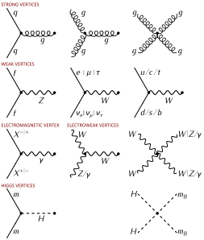
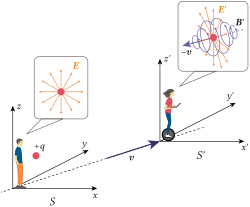
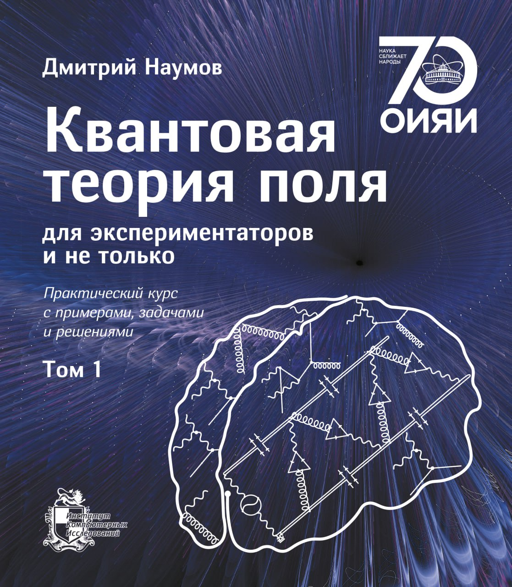

# What the Standard Model Is

## What the Standard Model Is

::: {.incremental}
- A model built in the framework of quantum field theory
  - unifies *electromagnetic* and *weak* interactions into the **electroweak interaction**
  - places electroweak and **strong interactions** in one gauge-theory framework

- Key nontrivial ingredients
  - **local symmetries** predict nontrivial interactions of quantum fields
  - **spontaneous symmetry breaking** turns massless fields into massive ones
  - **quantum anomalies** break classical conservation laws in the quantum theory
  - **the Higgs field and Higgs boson** were a central problem in physics for 45 years
:::

## The Code of the Universe {.sm-code-slide}

$$
	\begin{aligned}
		\mathcal{L}	 = \sum_k\left(\overline{L}_{k,L}i\hat{D}L_{k,L}+\overline{Q}_{k,L}i\hat{D}Q_{k,L} + \sum_{\psi=\ell,\nu,u,d}\overline{\psi}_{k,R}i\hat{D}\psi_{k,R}\right) -\frac{1}{4}F_{\mu\nu}F^{\mu\nu} - \frac{1}{4}G^i_{\mu\nu}G^{i,\mu\nu} \\
		             + |D_{\mu}\varphi|^2-\frac{\lambda^2}{2}\left(|\varphi|^2-\frac{v^2}{2}\right)^2\\
		             -\sum_{k,j}\left(\lambda_{kj}^\ell\overline{L}_{k,L}\ell_{j,R}\varphi +\lambda_{kj}^\nu\overline{L}_{k,L}\nu_{j,R}\varphi_c
		             +\lambda_{kj}^d\overline{Q}_{k,L}d_{j,R}\varphi +\lambda_{kj}^u\overline{Q}_{k,L}u_{j,R}\varphi_c+\textrm{ э.с.}\right),
	\end{aligned}
$$

::: {.marginnote .absolute .note-lg .sm-code-sticker top=370 left=0 width=430 style="--note-rotate: -2deg;"}
Great T-shirt print.
:::

::: {.marginnote .absolute .note-lg .note-right .sm-code-sticker top=510 left=770 width=330 style="--note-rotate: 2deg;"}
Easy enough?
:::

## Same Code. More Details {.lagrangian-scroll-slide}



## The Code of the Universe {.sm-code-universe-slide}

:::: {.columns}
::: {.column width="50%"}
::: {.media-figure .sm-vertices-figure style="--media-figure-width: 86%; --media-max-height: 460px; --media-bg: transparent; --media-shadow: none;"}
{.sm-inverted-media fig-alt="Standard Model Feynman diagram vertices"}
:::
:::

::: {.column width="50%"}

:::
::::

# Unity of Phenomena

## The Search for the Unity of Phenomena

::: {.takeaway}
Maxwell's move: two phenomena became one field.
:::

:::: {.columns}
::: {.column width="50%"}

- Electricity and magnetism stopped being separate forces.
- The electromagnetic field is one object.
- Electric and magnetic fields are different views of that object.

:::
::: {.column width="50%"}

| Old language | Unified language |
|---|---|
| electric field | electromagnetic field |
| magnetic field | electromagnetic field |
| separate phenomena | one relativistic field |

:::
::::

## Einstein's Paradox

:::: {.columns}
::: {.column width="42%"}

::: {.question}
A charged particle flies past a magnet with nonzero speed $v$.
:::

- In the lab frame, the magnetic Lorentz force acts on it:
  $$
  \mathbf F = q\,\mathbf v\times\mathbf B.
  $$
- Riding with the particle: $v=0$.

::: {.takeaway}
What force acts now?
:::

:::
::: {.column width="58%"}

::: {.fragment}
::: {.media-figure .einstein-paradox-figure}
{fig-alt="Electric and magnetic fields seen from different reference frames"}
:::

:::

:::
::::

# Unification of Electromagnetic and Weak Interactions

## Electromagnetic and Weak Interactions Are Very Different

:::: {.columns}
::: {.column width="72%"}

| What to compare | Electromagnetic | Weak |
|---|---|---|
| Range | long range | very short range, $\sim 10^{-18}$ m |
| Carrier mass | $m_\gamma = 0$ | $\approx 100$ GeV |
| Low-energy strength | strong at everyday scales | about $10^7$--$10^8$ times weaker |
| Parity | conserves | violates |
| Particle identity | keeps particle type | can change particle type |

:::
::: {.column width="28%"}

::: {.marginnote .absolute .note-lg .sm-code-sticker top=70 left=900 width=430 style="--note-rotate: -2deg;"}
Estimate the carrier mass:
$$
M_W \sim \frac{g}{\sqrt{G_F}} \sim 100\ \mathrm{GeV}
$$

:::

::: {.marginnote .absolute .note-lg .sm-code-sticker top=370 left=950 width=430 style="--note-rotate: 2deg;"}
Estimate range of the interaction:
$$
R \sim \frac{1}{M_W} \sim 10^{-18}\ \mathrm{m}
$$

:::

:::
::::

# How Do We Build Interactions with No Classical Analogy?

## A Reminder: How We Built Electrodynamics
::: incremental
- James Clerk Maxwell created a theory of electromagnetism by unifying electricity and magnetism.
- Maxwell's theory is incompatible with Galilean relativity but compatible with Einstein's relativity. Thus,
$$
\mathbf{E},\mathbf{B}\to A^\mu
$$

- The principle of least action gives a prescription:
$$
i\partial_\mu\to iD_\mu=i\partial_\mu+qA_\mu
$$
- Thus, a free Lagrangian
$$
\mathcal{L}=\overline{\psi}(i\gamma^\mu\partial_\mu-m)\psi
$$
- becomes an interacting Lagrangian:
$$
\mathcal{L}=\overline{\psi}(i\gamma^\mu D_\mu-m)\psi = \overline{\psi}(i\gamma^\mu\partial_\mu-m)\psi - q\overline{\psi}\gamma^\mu \psi A_\mu
$$
:::

## The Three Physicist Friends Story
:::: {.columns}

::: {.column width="50%"}
::: {.incremental}
- A theorist and two experimentalists are sitting in a bar.
- The theorist says:
  - "We need to know the electron field at two astrophysically distant points. You should go there and measure it."
  - "Remember, the phase of the electron field is a convention. You can choose it arbitrarily at each point."
- The experimentalists fly to very distant destinations $x$ and $y$, with only one-way communication.
:::

:::
::: {.column width="50%"}
::: {.fragment}

:::

:::

::::

## The Three Physicist Friends Story: A Problem
::: incremental
- The experimentalists measured the electron field at points $x$ and $y$ and sent the results back to the theorist.
- But they all forgot to agree on the phase convention. 
- The theorist received two numbers, but he cannot compare them:
$$
\psi(x)-\psi(y) 
$$
or
$$
\psi(x)e^{i\alpha(x)}-\psi(y)e^{i\alpha(y)}
$$
- Not knowing which **constant** phases $\alpha(x)$ and $\alpha(y)$ were used, the theorist cannot compare the two numbers.
- The problem is even worse. For two infinitesimally close points, he cannot calculate the derivative $\partial_\mu \psi(x)$. Therefore, even a *free* theory is not well-defined!

:::

## Gauge Invariance: A New Principle
::: incremental
- The theorist:
  - A theory should not depend on the choice of phase convention at any point.
- A free Lagrangian
$$
\mathcal{L}_0=\overline{\psi}(i\gamma^\mu\partial_\mu-m)\psi
$$
is not invariant under local phase transformations $\psi(x)\to e^{i\alpha(x)}\psi(x)$:
$$
\mathcal{L}\to \mathcal{L} - \overline{\psi}\gamma^\mu\psi\partial_\mu\alpha(x)
$$  

::: 

## Gauge Invariance: A New Principle

:::: {.columns}
::: {.column .gauge-principle-text width="58%"}
::: incremental
- But this Lagrangian is **invariant**:
$$
\mathcal{L} = \overline{\psi}(i\gamma^\mu\partial_\mu-m)\psi -q\overline{\psi}\gamma^\mu\psi A_\mu-\frac{1}{4}F_{\mu\nu}F^{\mu\nu}
$$
under simultaneous transformations:
$$
\begin{aligned}
\psi(x)&\to e^{i\alpha(x)}\psi(x)\\
A_\mu(x)&\to A_\mu(x)+\frac{1}{q}\partial_\mu\alpha(x)
\end{aligned}
$$
- This gives QED.
- As a bonus, the photon is massless. Otherwise, $$m_A^2A_\mu A^\mu$$ is not invariant under the gauge transformation.
:::
:::

::: {.column width="42%"}
::: {.fragment}

:::
:::
::::

## Scalar Electrodynamics as an Example of Gauge Invariance
::: incremental
- The same principle for a charged spin-0 field:
$$
\mathcal{L}_0=(\partial_\mu\phi^*)(\partial^\mu\phi)-m^2\phi^*\phi-\frac{1}{4}F_{\mu\nu}F^{\mu\nu}.
$$

- Make the theory gauge invariant by replacing $\partial_\mu\to D_\mu$:
$$
\begin{aligned}
D_\mu&=\partial_\mu+iqA_\mu,\\
\mathcal{L}&=(D_\mu\phi)^*(D^\mu\phi)-m^2\phi^*\phi-\frac{1}{4}F_{\mu\nu}F^{\mu\nu}.
\end{aligned}
$$

- Expanding the covariant derivatives gives
$$
\begin{aligned}
\mathcal{L}=\mathcal{L}_0
&-iqA^\mu\phi^*(\partial_\mu\phi)
+iq(\partial_\mu\phi^*)A^\mu\phi\\
&+q^2\phi^*\phi A^\mu A_\mu .
\end{aligned}
$$

- Gauge invariance predicts the interaction between $\phi$ and $A_\mu$!
:::

## Big Cats Need a Break



## The Algorithm
::: incremental
- Gauge invariance is now a method for predicting interactions.
- The algorithm is simple:
  - Take a free theory.
  - Replace $\partial_\mu\to D_\mu$
  - Introduce one compensating field $A^\mu_i$ for each generator of the symmetry group.
  - Introduce $F_{\mu\nu}$ and a gauge-invariant Lagrangian for the new fields.
  - The interaction is no longer optional.
:::

## Symmetry Becomes Dynamics

> If symmetries give conservation laws, perhaps interactions are also dictated by symmetry.

::: {.muted}
Salam and Ward, 1961
:::

# The Pillars of the Standard Model
:::: {.columns}

::: {.column width="56%"}

::: {.fragment data-fragment-index="1"}
1. A symmetry group 
$$
SU(2)_L\times U(1)_Y
$$
  - it requires all fermion and gauge-boson masses to vanish. This is not what we observe.
:::

::: {.fragment data-fragment-index="2"}
2. A symmetry breaking mechanism
  - it gives particles their masses
:::
:::

::: {.column width="20%"}
::: {.media-figure .fragment data-fragment-index="1" style="--media-max-height: 205px; --media-bg: transparent; --media-shadow: none;"}
{fig-alt="Symmetric butterfly"}
:::

::: {.media-figure .fragment data-fragment-index="2" style="--media-max-height: 205px; --media-bg: transparent; --media-shadow: none;"}
{fig-alt="Butterfly with broken symmetry"}
:::
:::

::: {.column width="24%"}
::: {.media-figure style="--media-max-height: 430px;"}
{fig-alt="Cover of Quantum Field Theory for Experimentalists and Not Only"}
:::
:::
::::

# Origin of Mass

## Six Definitions of Mass
::: incremental

1. Inertial mass — a measure of resistance to acceleration under an applied force.
2. Active gravitational mass — the strength of the gravitational field produced by a body.
3. Passive gravitational mass — a measure of response to an external gravitational field.
4. Rest energy — defined through the relation $E=mc^2$.
5. Source of spacetime curvature — the role of mass in general relativity.
6. Quantum mass — a quantity inverse to the Compton wavelength.
:::

::: {.fragment}

Experiments show that all these masses are equal to, or proportional to, one another.
:::

## The Secret Origin of Mass

::: incremental
- Modern physics suggests that masses appeared dynamically shortly after the **Big Bang**, through a phase transition.
- After the phase transition, a scalar (Higgs) field condensed; this generated particle masses.
- Metaphorically, we live inside a **superconductor**.
- There are two distinct mechanisms of mass generation:
  - for gauge bosons
  - for fermions.

:::

# Mass Generation of a Vector Boson

## Meissner Effect {.meissner-effect-slide}
:::: {.columns}
::: {.column width="40%"}
::: {.meissner-effect-text}
::: incremental 
- An external magnetic field is expelled from a superconductor.
- Near the surface it induces a superconducting current.
- This screening current produces the levitation force.
- In field language:
$$
\left(\nabla^2-m_\gamma^2\right)A^\mu=0,
\qquad
m_\gamma^2=\frac{q^2n_e}{m}.
$$
:::
:::
:::

::: {.column width="60%"}

:::
::::

## The Higgs Mechanism in the Standard Model
::: incremental
- The Higgs scalar field produces a **screening** current:
$$
j^\mu = -e^2 v^2 A^\mu
$$
- The Maxwell equation
$$
\partial_\nu F^{\nu\mu} = j^\mu =-e^2 v^2 A^\mu
$$
yields
$$
\left(\partial^2+m_A^2\right)A^\mu=0, \quad \mathrm{with}\quad \boxed{m_A^2= e^2v^2}.
$$
- This is exactly the Meissner effect.
:::

# Mass Generation of a Fermion
## Two Coupled Pendulums
:::: {.columns}
::: {.column width="43%"}
::: incremental
- Small angles:
$$
\ddot{\boldsymbol{\theta}}=-D\boldsymbol{\theta},
\qquad
\boldsymbol{\theta}=
\begin{pmatrix}
\theta_1 \\
\theta_2
\end{pmatrix}
$$
$$
D=
\begin{pmatrix}
\omega_0^2+\frac{k}{m_1} & -\frac{k}{m_1}\\
-\frac{k}{m_2} & \omega_0^2+\frac{k}{m_2}
\end{pmatrix},
$$
$$
\omega_0^2=\frac{g}{L}.
$$
- Normal modes:
$$
\omega_-^2=\omega_0^2,
\qquad
\boldsymbol v_-=(1,1)
$$
$$
\omega_+^2=\omega_0^2+
k\left(\frac{1}{m_1}+\frac{1}{m_2}\right),
\qquad
\boldsymbol v_+=
\left(1,-\frac{m_1}{m_2}\right)
$$
:::
:::

::: {.column width="57%"}

:::
::::

## Chiral Waves Become Massive Normal Modes {.chiral-mass-slide}
:::: {.columns}
::: {.column width="42%"}
::: {.chiral-mass-text}
- In 1D, with $c=\hbar=1$, massless chiral waves are independent:
$$
i\partial_t
\begin{pmatrix}R\\L\end{pmatrix}
=
\begin{pmatrix}p&0\\0&-p\end{pmatrix}
\begin{pmatrix}R\\L\end{pmatrix}.
$$

::: incremental
- The Higgs condensate couples them:
$$
m=\frac{y_f v}{\sqrt2},
\qquad
H(p)=
\begin{pmatrix}p&m\\m&-p\end{pmatrix}.
$$
- Normal frequencies:
$$
\omega_\pm(p)=\pm\sqrt{p^2+m^2}.
$$
- At rest:
$$
\Psi_+(0)=\frac{R+L}{\sqrt2},
\qquad
\Psi_-(0)=\frac{R-L}{\sqrt2}.
$$
:::
:::
:::

::: {.column width="58%"}

:::
::::

## A Finite Condensate Layer {.chiral-slab-slide}
:::: {.columns}
::: {.column width="42%"}
::: {.chiral-slab-text}
- Let the Higgs condensate occupy a layer:
$$
m(x)=
\begin{cases}
0, & x<0,\\
m_0, & 0<x<a,\\
0, & x>a.
\end{cases}
$$
- For $E>m_0$, the static layer conserves $E$:
$$
E^2=q^2+m_0^2,
\qquad
q=\sqrt{E^2-m_0^2}<E,
\qquad
v_g=\frac{q}{E}<1.
$$
- For an incoming $R$ wave:
$$
r=
\frac{-im_0\sin qa}
{q\cos qa-iE\sin qa},
$$
$$
t=
\frac{q\,e^{-iEa}}
{q\cos qa-iE\sin qa}.
$$
- The slider changes $a$ in the exact solution.
:::
:::

::: {.column width="58%"}

:::
::::

## Two Mechanisms, One Condensate

The Higgs condensate creates a gap in the spectrum in two different ways.

:::: {.columns}
::: {.column width="50%"}
**Vector bosons: Meissner mechanism**

- The condensate behaves like a superconductor.
- A gauge field induces a screening current.
- Free propagation is lost: the field becomes short-range.
$$
\left(\partial^2+m_A^2\right)A^\mu=0,
\qquad
m_A^2=e^2v^2.
$$
:::

::: {.column width="50%"}
**Fermions: coupled chiral waves**

- Without the condensate, $R$ and $L$ move independently at $c$.
- The condensate couples them: left sources right, and right sources left.
$$
m_f=\frac{y_fv}{\sqrt2}.
$$
- Stable waves are normal modes:
$$
\Psi_\pm(0)=\frac{R\pm L}{\sqrt2}.
$$
:::
::::

## Neutron Decay in QFT




